# SUTNet: Image Restoration Network Using Swin-Unet Transformer to Improve Camera Image Quality

> **Abstract:** 
> *In this paper, deep learning-based denoising network (Gaussian color image denoising and real image denoising) 
> and motion deblurring network are dealt with for the most serious image degradation problems. The proposed model is implemented 
> with the Swin-Unet transformer as the basic structure. The structure is constructed by grafting the Swin (Shifted window) 
> Transformer block, which has relatively little amount of computation in Transformer and can learn the context of image pixels, 
> to the U-Net structure that is widely used in the medical field and is beneficial for improving contour details. 
> In the Swin Transformer block of the proposed neural network, the Windows Multi-head Dconv Attention (WMDA) module replaces 
> the existing Multi-head Self Attention (MSA), and the Locally-enhanced Gated Dconv feed-forward network (LeGD) module replaces 
> the existing Feed Forward Network (FNN). Through this, the proposed model makes it effective for image restoration by well 
> understanding the context between adjacent pixels and the context between channels and preserving image details.* 

The Master of Science thesis can be found [here](https://drive.google.com/drive/folders/1IVTJJdkdZaFbWe5Ohn0aMlMQVuy7A00Z?usp=share_link).

## Network Architecture
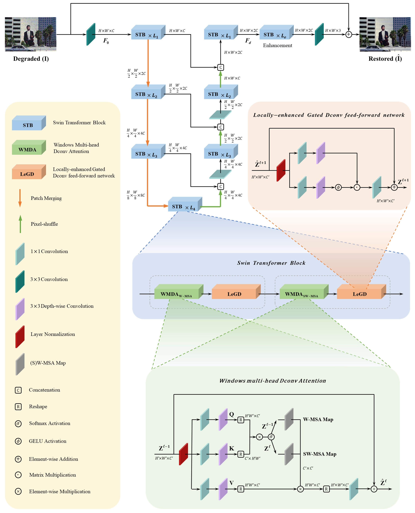

## Training and Evaluation

The used training and testing datasets and visual results can be downloaded as follows:

<table>
  <tr>
    <th align="center">Task</th>
    <th align="center">Training Datasets</th>
    <th align="center">Testing Datasets</th>
    <th align="center">SUTNet's Pre-trained Models</th>
    <th align="center">SUTNet's Visual Results</th>
  </tr>
  <tr>
    <td align="center">Gaussian Color Image Denoising</td>
    <td align="center">DIV2K, WaterlooED, BSD400 and Flickr2K</td>
    <td align="center">BSD68, Kodak24, McMaster and Urban100</td>
    <td align="center"><a href="https://drive.google.com/drive/folders/14fDFI8g-WXxsK-GxZVfYh7fW_nx4Yvkn?usp=share_link">Download</a></td>
    <td align="center"><a href="https://drive.google.com/drive/folders/1imVUt6VVLWVxAp9LTNVGV-codyVB2Ox_?usp=share_link">Here</a></td>
  </tr>
  <tr>
    <td align="center">Real Image Denoising</td>
    <td align="center">SIDD-Medium Dataset</td>
    <td align="center">SIDD Validation Dataset</td>
    <td align="center"><a href="https://drive.google.com/drive/folders/1fyaTwacjGCdDGPCvGZ4ka6hfP3GVIS6B?usp=share_link">Download</a></td>
    <td align="center"><a href="https://drive.google.com/drive/folders/1Y7DFmFIlyYe8ur7fzC-_8XQ6Qj0syTzf?usp=share_link">Here</a></td>
  </tr>
  <tr>
    <td align="center">Motion Deblurring</td>
    <td align="center" colspan="2">GoPro Dataset</td>
    <td align="center"><a href="https://drive.google.com/drive/folders/1zHXWOa7DzzfXxx8Kn8UOS3ybkmVKNUcL?usp=share_link">Download</a></td>
    <td align="center"><a href="https://drive.google.com/drive/folders/1LU1eoWx8asTX4tHU9BdMaWGKWMHZmm79?usp=share_link">Here</a></td>
  </tr>
</table>

## Instructions

<table>
  <tr>
    <th align="center">Task</th>
    <th align="center">Training Instructions</th>
    <th align="center">Testing Instructions</th>
  </tr>
  <tr>
    <td align="center">Gaussian Color Image Denoising</td>
    <td align="center"><a href="Denoising/README.md#training">Link</a></td>
    <td align="center"><a href="Denoising/README.md#evaluation">Link</a></td>
  </tr>
  <tr>
    <td align="center">Real Image Denoising</td>
    <td align="center"><a href="Denoising/README.md#training-1">Link</a></td>
    <td align="center"><a href="Denoising/README.md#evaluation-1">Link</a></td>
  </tr>
  <tr>
    <td align="center">Motion Deblurring</td>
    <td align="center"><a href="Motion_Deblurring/README.md#training">Link</a></td>
    <td align="center"><a href="Motion_Deblurring/README.md#evaluation">Link</a></td>
  </tr>
</table>

## Results

Experiments are performed for different image restoration tasks including, gaussian color image denoising, real image denoising, and motion deblurring. Detailed results can be found in the paper.

### PSNR and SSIM scores

<strong>Gaussian Color Image Denoising</strong>

 
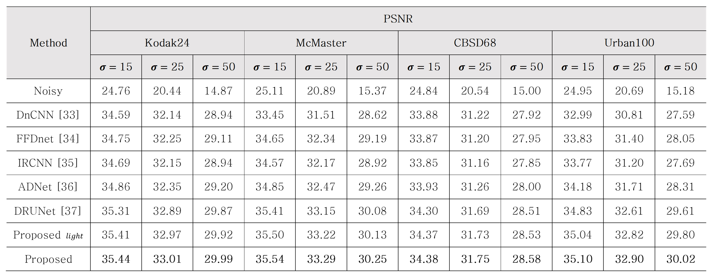
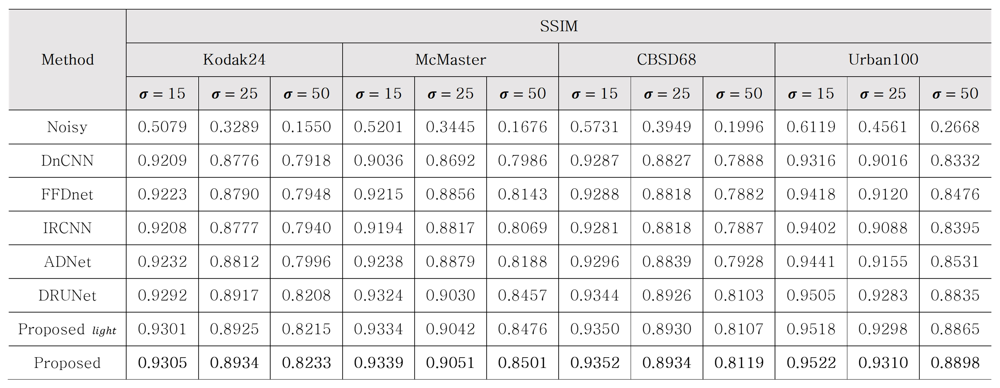

<strong>Real Image Denoisng</strong>

 
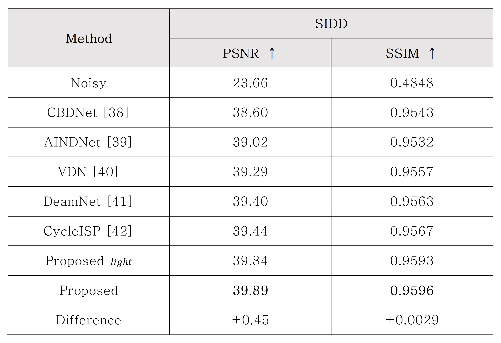

<strong>Motion Deblurring</strong>

 
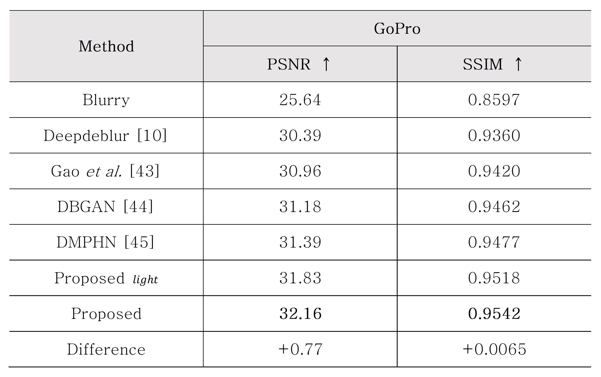

### Visual results

<strong>Gaussian Color Image Denoising</strong>

 

- Gaussian color image denoising results of Urban100 with noise level 50.

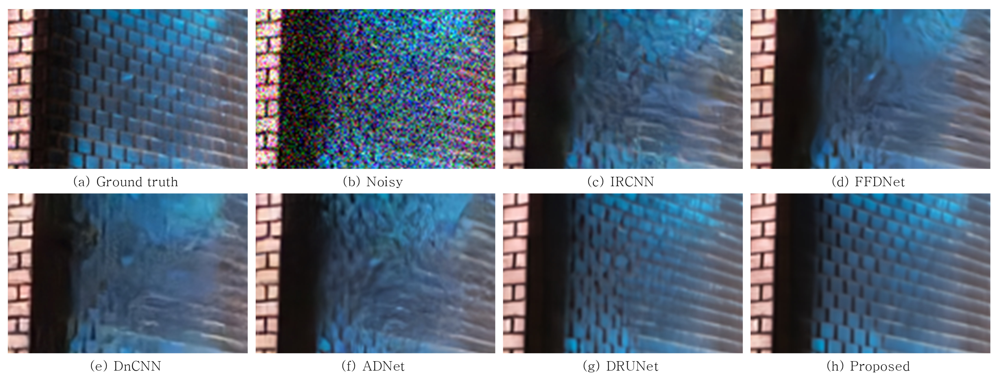
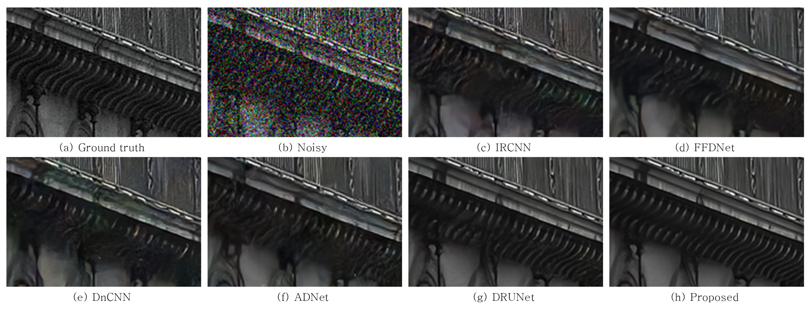

<strong>Real Image Denoisng</strong>

 

- Real image denoising results of SIDD validation dataset.

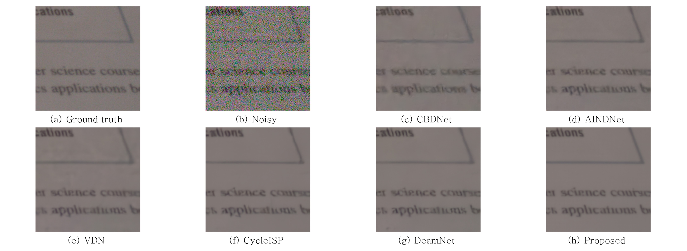
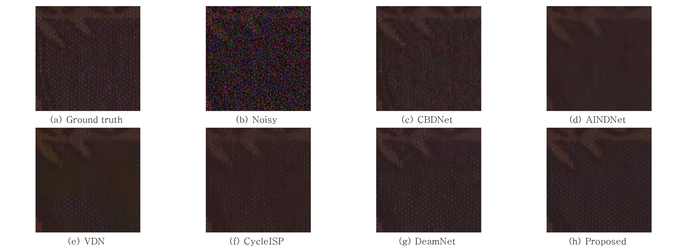

<strong>Motion Deblurring</strong>

 

- Image motion deblurring results of GoPro dataset.

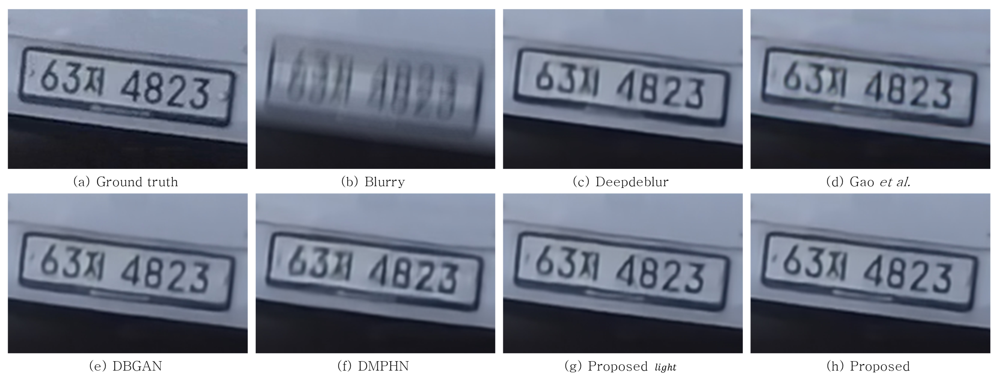

### Ablation study

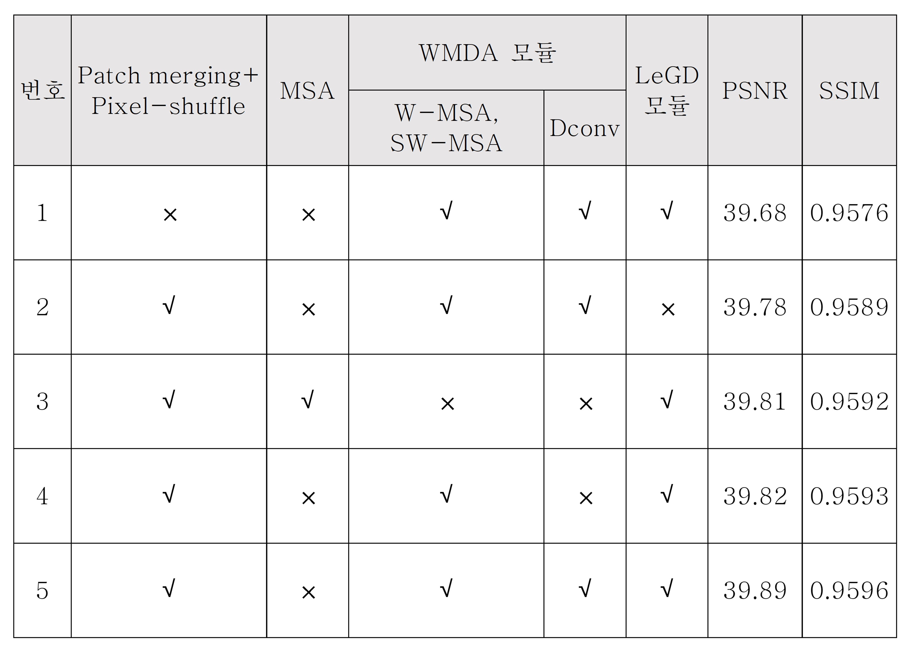

The contribution of each component is analyzed through an ablation study to verify the performance of each module in the model. 
It demonstrated that the proposed model extracts the contextual information within the image and effectively improves the image quality.

Pre-trained models of SUTNet can be downloaded [here](#training-and-evaluation).

## Contact
Should you have any question, please contact gooni0906@gmail.com.
